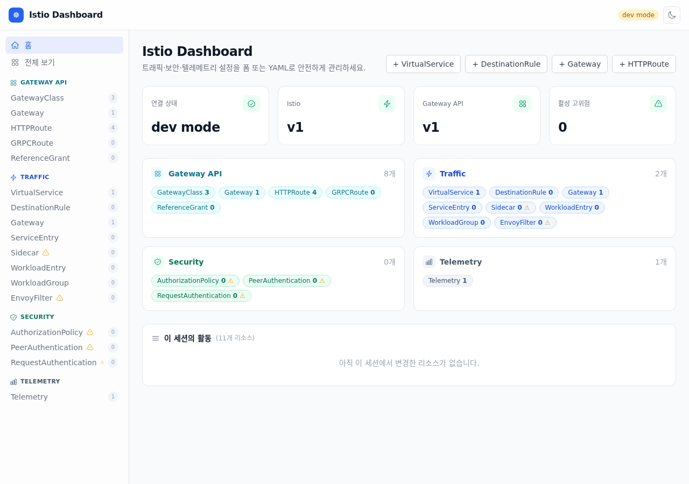
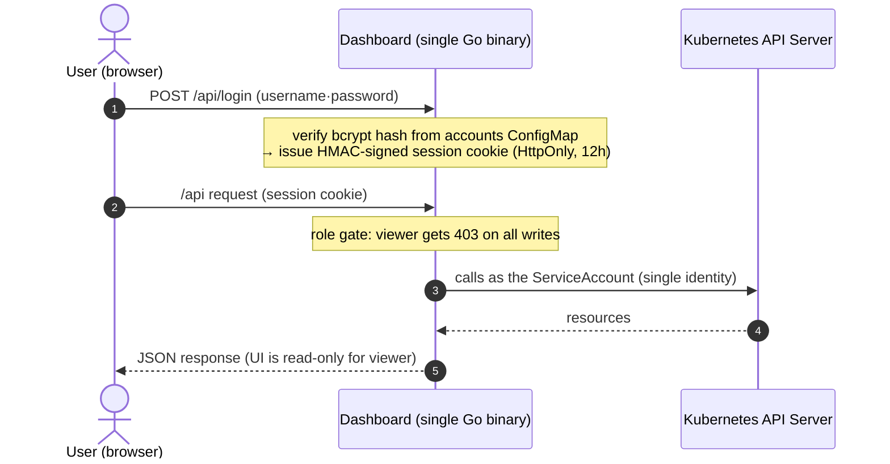
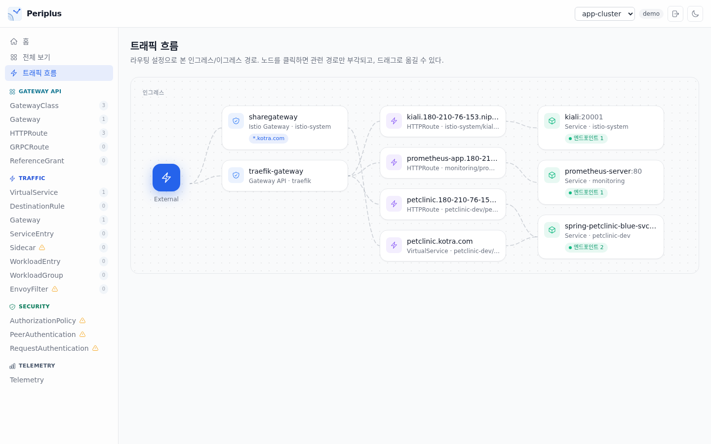
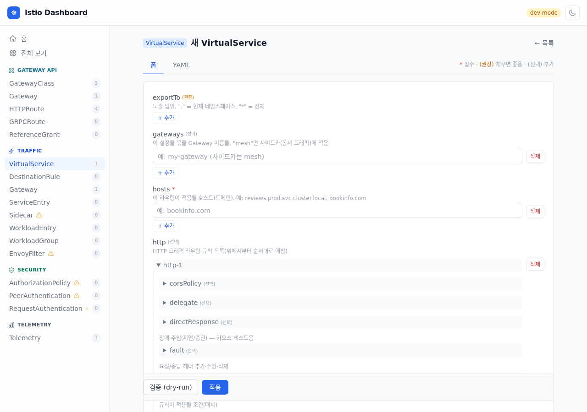
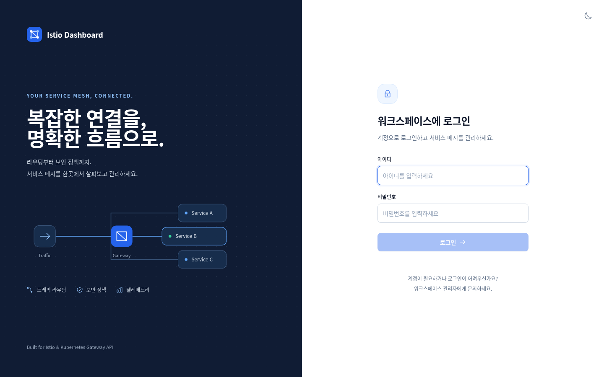
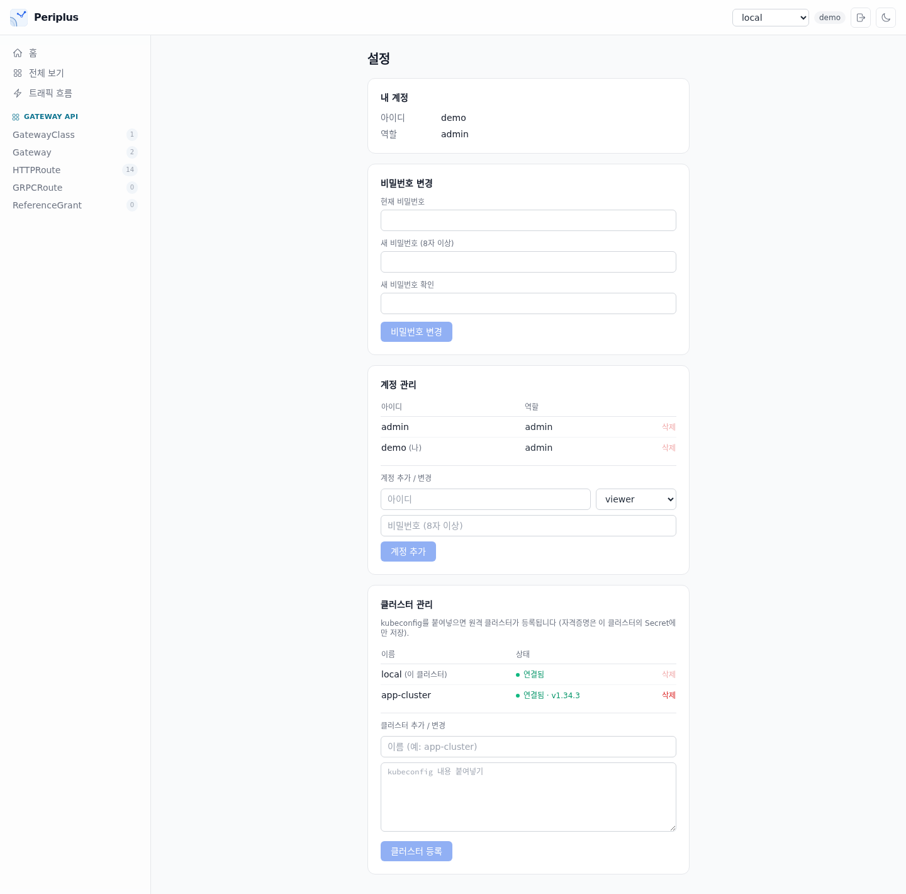

# Periplus

[한국어](README.md) | **English**


> [!NOTE]
> Periplus is a third-party tool for Istio. It is not an official Istio or CNCF project and is not affiliated with or endorsed by them.

> **Periplus** — named after the ancient Greek sailing guides — is a single-binary web console to **safely view, create, and fix** Istio · Gateway API routing/security/telemetry configuration, with accounts and role-based access.



---

## TL;DR

- **App-local accounts + roles** — accounts live in one ConfigMap (`user = "role:bcryptHash"`); login issues an HMAC-signed session cookie. All cluster operations run as a **single identity** (the pod's ServiceAccount) while app roles (`admin`/`editor`/`viewer`) decide who can do what. On install, if no admin account exists, an initial **`admin`/`admin`** account is created — and the first login **forces a password change**.
- **Write safety first** — every write goes through `dry-run` validation → a `kubectl diff`-style preview → apply. Optimistic locking via `resourceVersion` detects 409 conflicts and shows *your edit vs the server's latest*; high-risk kinds require typing the resource name to confirm. Every change made through the dashboard is recorded in the home page's **change history** with the account name.
- **Stateless HA · air-gapped** — a single Go binary embedding the React SPA via `embed.FS`. No server-side session store (signed cookies), so it scales horizontally, and zero CDN dependencies means it runs in closed networks out of the box.
- **Generic resource engine** — built on the dynamic client, not tied to specific CRDs. 12 Istio kinds + 7 Gateway API kinds through one CRUD pipeline.
- **Multi-cluster** — register remote clusters by pasting a kubeconfig (settings page, admin only) and switch via the header dropdown. Credentials are stored only in a Secret on the cluster running the dashboard; nothing is installed on target clusters.

---

## Why this exists

A single typo in a `VirtualService` can take down an entire service. Yet the usual options are raw YAML with `kubectl apply` (no protection against human error) or observability-focused tools like Kiali (weak at editing configuration). This project fills the gap in between: **a console for safely editing configuration**.

One constraint drove the design — **"it must work just by deploying the dashboard."** No extra CRDs or operators on the cluster; it reads and renders existing resources the moment it connects. Kubernetes is the single source of truth and the dashboard itself holds no state.

---

## Architecture & security model



- **Local accounts = ConfigMap** — one key in the `periplus-accounts` ConfigMap is one account (`username: "role:bcryptHash"`). Stored in the cluster (etcd), not the pod, so **accounts survive restarts and redeploys**; Helm doesn't manage this CM so upgrades keep it. Changes propagate through the mounted volume **within ~1 minute, no restart**.
- **Account management UI** — admins can add accounts, change roles/passwords, and delete accounts from the settings page (`GET/PUT/DELETE /api/accounts`; the server patches the CM). Self-deletion, self role-change, and deleting the `admin` account are blocked to prevent lockout. `kubectl edit` works too.
- **Initial admin + forced change** — if no admin account exists at boot, `admin`/`admin` is created. Logging in with the initial password **locks the UI to a password-change screen** until you change it.
- **Three roles** — `viewer` (read-only) · `editor` (can write) · `admin`. The server gates every mutating request by role (403) and the UI disables buttons using the same information.
- **Change your own password** — user chip in the header → settings page, after verifying the current password (viewers included). The server patches only your own CM key.
- **Multi-cluster** — remote-cluster kubeconfigs are stored in the `periplus-clusters` Secret (key = cluster name). Register/delete is admin-only (`PUT/DELETE /api/clusters/{name}`, with a connectivity test on register), and the settings page shows each cluster's **connection status and version**. Every API takes a `?cluster=` parameter (default `local`). The CRD catalog and schema caches are per-cluster, so clusters with different CRDs installed are handled safely.
- **Sessions are signed cookies** — no server store, stateless HA intact. Without `SESSION_SECRET` a random per-boot key is used (restart = re-login).
- **Hardening** — security headers including CSP (`default-src 'self'`), HttpOnly cookies, distroless non-root image, readOnlyRootFilesystem.
- **Air-gapped** — the frontend bundle is inlined into the binary. Zero runtime external dependencies.

---

## Key features

### Generic resource engine
A single CRUD path (`/api/resources/{type}`) built on the dynamic client (unstructured) covers everything below. Only CRDs actually installed on the cluster are exposed (`/api/capabilities`, `/api/resourceTypes`).

| Category | Kinds |
|---|---|
| **Traffic** (Istio) | VirtualService · DestinationRule · Gateway · ServiceEntry · Sidecar · WorkloadEntry · WorkloadGroup · EnvoyFilter |
| **Security** (Istio) | AuthorizationPolicy · PeerAuthentication · RequestAuthentication |
| **Telemetry** (Istio) | Telemetry |
| **Gateway API** | GatewayClass · Gateway · HTTPRoute · GRPCRoute · TCPRoute · TLSRoute · ReferenceGrant |

### Multiple write safeguards
1. **Dry-run first** — `DryRun=All` catches admission-webhook and schema errors before saving.
2. **Diff preview** — line-level diff between the current and proposed object, `kubectl diff`-style.
3. **409 conflict control** — on `resourceVersion` mismatch, never blindly overwrite; show *my edit vs server latest* and let the user decide.
4. **High-risk confirmation** — kinds with a large blast radius require typing the resource name to delete/update.

### Traffic flow map
Draws the traffic path purely from routing configuration — no metrics dependency, so it works on any cluster immediately.

- **Ingress** — External → Gateway → Route (hosts) → Service (endpoint counts). Backends that don't exist or have zero endpoints get red edges + warning pills, so dead-end configs are caught at a glance.
- **Egress** — Mesh → egress Gateway → external hosts; ServiceEntries not referenced by any route are shown as direct egress paths. External backends get a badge with the ServiceEntry that covers them (wildcard host matching included).
- **Interaction** — click a node to spotlight only the paths through it, dimming everything else. Drag nodes to rearrange; hover a card and use the ↗ icon to jump to the resource editor.



### Role-aware UI + change history
- The UI checks the logged-in account's role up front: for viewers, forms and apply/delete buttons turn **read-only**. The server enforces the same rule (403), so the UI can't be bypassed.
- The home page's **change history** panel records create/update/delete operations made through the dashboard with account and timestamp (in-memory, last 200 — resets on restart; the structured audit log is the durable record). Home cards also show the actual istiod control-plane version (e.g. `1.30.2`).

### Schema-driven forms + YAML dual editing
- `react-jsonschema-form` reads the CRD OpenAPI schema and generates input forms — safe editing without knowing YAML.
- **Required/recommended markers** — every field gets a `*` (required) · `(recommended)` · `(optional)` badge. On top of the CRD schema's `required`, a curated list compensates for Istio schemas not declaring top-level requireds (VS `hosts`, DR `host`, Gateway `selector`/`servers`, SE `hosts`/`ports`).
- **Reference-resolving forms** — `host`/`backendRefs` suggest Services, `subset` suggests DestinationRule subsets, `gateways`/`parentRefs` suggest Gateways from the live cluster, with existence badges (✓/⚠) and jump links. Free-text is preserved so external hosts and cross-namespace references still work.
- Form ↔ YAML stay in sync. If the object uses advanced fields the form can't express, the form tab locks with a "YAML only" notice → no field loss.

### UI
A dense, light-first console (dark mode toggle included). The accent color is managed in one CSS variable (`--accent`) — reskin with a one-line change. The YAML editor shows indent guides.



---

## Quick start (Kubernetes)

Running in-cluster is the default. You only need Docker and Helm (the image build is multi-stage — no local Go/Node required).

### 1) Image
Every release tag (`v*`) publishes an image via GitHub Actions — use it directly:
```bash
# prebuilt image (recommended)
ghcr.io/wonjune95/periplus:latest
```
Or build your own:
```bash
docker build -t <registry>/periplus:<tag> .
docker push <registry>/periplus:<tag>
```

### 2) Helm install
```bash
helm install periplus ./deploy/helm -n istio-system \
  --set image.repository=<registry>/periplus --set image.tag=<tag>
```
Key values: `image.*`, `imagePullSecrets` (private registries), `replicaCount` (stateless — scale for HA), `accountsConfigMap`, `clustersSecret`. The pod runs distroless non-root (uid 65532) with readOnlyRootFilesystem.

### 3) Expose — attach an HTTPRoute to your cluster's Gateway
```bash
# adjust parentRefs/hostname first
kubectl apply -f deploy/examples/httproute.yaml
```

### 4) Log in
On first boot the initial account **`admin` / `admin`** is created. Logging in takes you straight to a password-change screen — you must change it before entering the dashboard.



### 5) Add accounts
As admin, use **settings → account management** to add accounts and change roles/passwords in the UI (self-delete, self role-change, and deleting `admin` are blocked). The store is still a ConfigMap, so kubectl works too:
```bash
go run ./hack/bcrypt-hash.go 'password'                      # generate bcrypt hash
# (without Go) htpasswd -bnBC 10 "" 'password' | tr -d ':\n'
kubectl -n istio-system edit configmap periplus-accounts
# add to data:  username: "role:hash"   (role: admin | editor | viewer)
```
No restart needed — mounted-volume sync applies it within ~1 minute. See `deploy/examples/accounts-configmap.yaml`.

### 6) Register more clusters (optional)
To manage multiple clusters from one dashboard, go to **settings → cluster management** as admin and paste the target cluster's kubeconfig with a name. A connectivity test runs on registration, and the header dropdown switches clusters. Nothing is installed on target clusters; credentials live only in the `periplus-clusters` Secret next to the dashboard.



---

## Configuration

| Flag / env | Default | Description |
|---|---|---|
| `--addr` | `:8080` | listen address |
| `--dev` | `false` | skip login + use local kubeconfig (**refuses to boot in-cluster**) |
| `--kubeconfig` | (default loading rules) | dev-only kubeconfig path |
| `ACCOUNTS_DIR` | `/etc/periplus/accounts` | accounts ConfigMap mount path |
| `ACCOUNTS_CONFIGMAP` / `POD_NAMESPACE` | (set by Helm) | CM that password changes / initial-admin creation patch |
| `SESSION_SECRET` | (none) | session cookie signing key; empty = random per boot (restart = re-login) |
| `CLUSTERS_SECRET` / `POD_NAMESPACE` | (set by Helm) | multi-cluster: Secret holding remote kubeconfigs (empty = local only) |

Probes: `/healthz` (live) · `/readyz` (ready) · `/metrics` (Prometheus). Logs are structured `slog` JSON (request log + write audit log).

---

## Design decisions

### Why a generic engine instead of per-kind structures
The initial design had dedicated providers for `HTTPRoute`/`VirtualService`. But Istio + Gateway API span ~20 kinds with evolving CRD versions; per-kind models scale maintenance linearly and break on version changes. → Switched to **dynamic client + auto-generated forms from CRD OpenAPI schemas**: adding a kind is one registry line, and schema changes are absorbed automatically. Curated forms can still be layered on for a few kinds that need them.

### Why app-local accounts instead of token passthrough
The first implementation passed the user's Kubernetes bearer token through, authorizing with cluster RBAC — accurate, but issuing/delivering/renewing tokens per user was operationally painful and login UX was poor. → Switched to **app-local accounts (ConfigMap) + roles**, with all cluster operations under a single SA identity. The downside (K8s audit logs show the SA, not the user) is offset by the dashboard's own change history recording account names. If per-user K8s RBAC parity becomes necessary, this can be extended with Impersonation.

### Why no real-time SSE streams
The design stage considered per-user watch → SSE live sync. But keeping the server stateless for HA means opening a watch per connection — replicas × concurrent users watch connections against the API server. For an internal ops tool (tens of concurrent users, low change frequency) that cost wasn't justified. → Kept the server stateless and converged on the **in-memory change history** (30s refresh) plus manual refresh. *A deliberate trade: "unbreakable stateless HA" over "nice-to-have real-time".*

### Why the `--dev` boot guardrail
`--dev` skips login and uses a local kubeconfig — convenient locally, an auth bypass if it ever runs in production. So when `KUBERNETES_SERVICE_HOST` (injected into every pod) is detected together with `--dev`, the process **exits immediately** (inducing CrashLoopBackOff). Accidentally shipping dev mode to a cluster is structurally impossible.

---

## Project layout

```
periplus/
├─ cmd/server/main.go          # entrypoint: ServeMux, probes/metrics, graceful shutdown
├─ internal/
│  ├─ api/                     # JSON handlers (resources CRUD, login/accounts, capabilities, history, flow map)
│  ├─ auth/                    # local accounts (bcrypt) + HMAC sessions
│  ├─ k8s/                     # dynamic client factory, kind registry, discovery, reference lookups
│  ├─ assets/                  # built React (dist) embed + SPA fallback
│  └─ observability/           # slog logging, Prometheus metrics
├─ web/                        # React 18 + TS + Vite + Tailwind + rjsf + CodeMirror
├─ hack/bcrypt-hash.go         # password hash helper
├─ deploy/
│  ├─ helm/                    # chart: deployment / service / rbac / values
│  └─ examples/                # accounts-configmap.yaml · httproute.yaml
├─ .github/workflows/          # ci.yml (test/build) · release.yml (tag → ghcr.io image + chart)
├─ Dockerfile  go.mod
```

## Tech stack
- **Backend** — Go 1.26, `net/http` (1.22 ServeMux), `client-go` dynamic client, `istio.io/client-go`, `sigs.k8s.io/gateway-api`
- **Frontend** — React 18 · TypeScript · Vite · Tailwind · TanStack Query · React Router · react-jsonschema-form · CodeMirror
- **Deploy** — multi-stage Docker (distroless, non-root) · Helm

## Development

For local development/testing only (not needed for deployment). Requirements: Go 1.26+, Node.js 20+, a kubectl context (kind/docker-desktop is fine).

```bash
go run ./cmd/server --dev          # backend :8080, local kubeconfig (refuses to boot in-cluster)
cd web && npm run dev              # frontend HMR: Vite :5173 → /api proxy → :8080

go test ./...                      # unit tests (auth boundaries, registry cache, write guards, audit, flow map)
go vet ./...

# single binary without a container
cd web && npm ci && npm run build  # frontend build → internal/assets/dist
CGO_ENABLED=0 go build -ldflags="-s -w" -o bin/server ./cmd/server
```

## Permission model

Permissions come in two separate layers — cluster permissions and user permissions:

| Layer | Owner | Scope |
|---|---|---|
| Cluster (K8s RBAC) | pod ServiceAccount | CRUD on managed CRDs (`*.networking.istio.io`, `security/telemetry.istio.io`, `*.gateway.networking.k8s.io`) + read namespaces/services/endpoints + patch accounts CM / clusters Secret. Configured by Helm. |
| User (app roles) | accounts ConfigMap | `admin` = write + account/cluster management, `editor` = write, `viewer` = read-only. The server gates every mutating request (403). |

Account management: admins use the **account management UI** on the settings page, or edit the `periplus-accounts` ConfigMap directly (add key = add account, edit role string = change role, delete key = delete account). Everyone changes their own password on the settings page.

## Appendix — install on K8s in one go

Both the chart and image are published to ghcr.io, so no clone is needed:

```bash
# install (pick any namespace; image defaults to the prebuilt ghcr one)
helm install periplus oci://ghcr.io/wonjune95/charts/periplus \
  --version 0.4.0 -n istio-system

# try it before exposing
kubectl -n istio-system port-forward svc/periplus 8080:8080
# → http://localhost:8080  (initial account admin / admin — first login forces a password change)
```

To install from source, `git clone` then `helm install periplus ./deploy/helm -n istio-system` (see quick start step 1 for image builds).

Expose it to match your cluster:

```bash
# with Gateway API — adjust parentRefs/hostname first
kubectl apply -f deploy/examples/httproute.yaml

# with an Ingress controller — create an Ingress backed by service periplus:8080
```

After installing: ① change the admin password (forced at first login) ② add accounts (settings → account management) ③ for multi-cluster, register kubeconfigs (settings → cluster management). Uninstall with `helm uninstall periplus -n istio-system` (the accounts ConfigMap and clusters Secret survive — delete them too for a full cleanup).

## License

[MIT](LICENSE)
