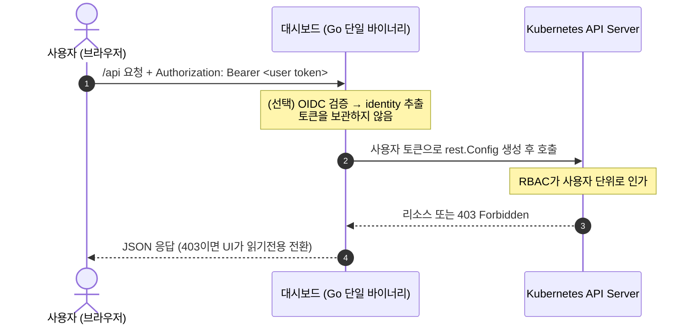

# Istio Routing Dashboard


> Istio · Gateway API 라우팅/보안/텔레메트리 설정을 **사용자 본인 권한으로** 보고·만들고·고치는 단일 바이너리 웹 콘솔. Kong Manager / APISIX Dashboard의 Istio 판.


---

## 요약 (TL;DR)

- **Zero-Trust 보안** — 자체 DB·세션·관리자 토큰 없음. 요청의 Bearer 토큰을 그대로 Kubernetes API에 패스스루하고 **인가는 전적으로 K8s RBAC에 위임**한다. 대시보드는 권한 판단을 하지 않는다(403은 클러스터가 준다).
- **쓰기 안전 우선** — 모든 쓰기는 `dry-run` 선검증 → `kubectl diff` 스타일 미리보기 → 적용. `resourceVersion` 낙관적 락으로 409 충돌을 감지해 *내 수정본 vs 서버 최신본*을 대조하고, 고위험 kind는 이름 타이핑 확인을 요구한다.
- **무상태 HA · 에어갭** — Go `embed.FS`에 React SPA를 내장한 단일 바이너리. 세션 상태가 없어 N개 복제본으로 수평 확장되고, 외부 CDN 의존이 0이라 폐쇄망에서 즉시 구동된다.
- **제네릭 리소스 엔진** — 특정 CRD에 종속되지 않는 dynamic client 기반. Istio 12종 + Gateway API 7종을 하나의 CRUD 파이프라인으로 다룬다.

---

## 왜 만들었나

Istio 라우팅은 `VirtualService` 하나의 오타가 서비스 전체 장애로 직결된다. 그런데 이걸 다루는 방법은 보통 두 갈래다 — 날 YAML을 `kubectl apply` 하거나(휴먼 에러에 무방비), Kiali처럼 관측에 특화된 도구를 쓰거나(설정 편집은 약함). 이 프로젝트는 그 사이의 빈칸, 즉 **"안전하게 설정을 편집하는 콘솔"** 을 채운다.

핵심 제약은 하나였다 — **"대시보드를 띄우는 것만으로 동작해야 한다."** 클러스터에 별도 CRD/Operator를 설치하지 않고, 붙는 순간 기존 리소스를 읽어 렌더링한다. 이를 위해 K8s를 유일한 진실의 원천으로 두고, 대시보드 자신은 상태를 갖지 않도록 설계했다.

---

## 아키텍처 & 보안 모델



- **Bearer 토큰 패스스루** — 백엔드는 사용자 토큰을 저장·가공하지 않고 요청마다 K8s 클라이언트 생성에 그대로 주입한다. 모든 읽기·쓰기가 사용자 본인으로 수행되며, 인가는 클러스터 RBAC가 판단한다. 대시보드에 권한 우회 표면이 존재하지 않는다.
- **OIDC 검증은 얇은 선택 레이어** — issuer/audience를 검증해 조기 401 + 감사용 identity를 뽑는다. 끄면(`OIDC_ISSUER` 미설정) 검증을 건너뛰되 패스스루는 그대로라, 비-OIDC 환경(SA 토큰)이나 dev(로컬 kubeconfig)에서도 코드 변경 없이 동작한다.
- **무상태 HA** — 세션이 토큰에만 있으므로 스티키 세션·공유 캐시가 필요 없다.
- **에어갭** — 프론트 번들을 바이너리에 인라인. 런타임 외부 의존 0.

---

## 핵심 기능

### 제네릭 리소스 엔진
dynamic client(unstructured) 기반의 단일 CRUD 경로(`/api/resources/{type}`)로 아래를 모두 다룬다. 클러스터에 설치된 CRD만 자동 노출된다(`/api/capabilities`, `/api/resourceTypes`).

| 카테고리 | Kind |
|---|---|
| **Traffic** (Istio) | VirtualService · DestinationRule · Gateway · ServiceEntry · Sidecar · WorkloadEntry · WorkloadGroup · EnvoyFilter |
| **Security** (Istio) | AuthorizationPolicy · PeerAuthentication · RequestAuthentication |
| **Telemetry** (Istio) | Telemetry |
| **Gateway API** | GatewayClass · Gateway · HTTPRoute · GRPCRoute · TCPRoute · TLSRoute · ReferenceGrant |

### 다중 쓰기 안전장치
1. **dry-run 선검증** — 저장 전 `DryRun=All`로 Admission Webhook·스키마 오류를 먼저 잡는다.
2. **diff 미리보기** — 적용 전 현재본과 적용본의 라인 단위 변경을 `kubectl diff` 스타일로 보여준다.
3. **409 충돌 제어** — `resourceVersion` 불일치 시 무조건 덮어쓰지 않고, *내 수정본 vs 서버 최신본* diff를 띄워 사용자가 덮어쓸지 결정하게 한다.
4. **고위험 확인** — 파급이 큰 kind는 리소스 이름을 직접 입력해야 삭제/수정이 진행된다.

### SSAR 권한 인식 UI
`SelfSubjectAccessReview`로 수정/삭제 권한을 미리 확인해, 권한이 없으면 폼을 **읽기전용**으로 전환한다. 불필요한 403 실패 요청을 UI 단계에서 차단한다.

### 스키마 자동 폼 + YAML 이중 편집
- `react-jsonschema-form`이 CRD OpenAPI 스키마를 읽어 입력 폼을 자동 생성 — YAML을 몰라도 안전하게 편집.
- **참조 해결 폼** — `host`는 Service, `gateways`는 Gateway로 실제 클러스터 리소스를 드롭다운 제안하고, 존재 여부 배지(✓/⚠)와 바로가기 링크를 붙인다. 외부 호스트·크로스 NS 참조를 막지 않도록 free-text는 유지한다.
- 폼 ↔ YAML 상호 동기화. 폼이 표현 못 하는 고급 필드가 있으면 폼 탭을 잠그고 "YAML 전용"으로 안내 → 필드 유실 방지.

### UI
다크 기본의 고밀도 콘솔. 액센트 색은 CSS 변수 한 곳(`--accent`)에서 관리되어 한 줄 수정으로 리스킨된다. 라이트/다크 토글 지원.


---

## 빠른 시작

### 사전 요구사항
- Go 1.26+, Node.js 20+
- 접근 가능한 Kubernetes 클러스터 + `kubectl` 컨텍스트 (dev는 docker-desktop/kind로 충분)

### 로컬 개발
```bash
# 백엔드: 로컬 kubeconfig 사용, :8080
make run                 # = go run ./cmd/server --dev

# 프론트엔드 HMR: 별도 터미널, Vite :5173 → /api 프록시 → :8080
make dev-web
```

### 프로덕션 빌드 (단일 바이너리)
```bash
make build               # web 빌드 → internal/assets/dist 임베드 → bin/server
./bin/server --addr :8080
```

### 컨테이너 · Helm
```bash
make docker              # 멀티스테이지(node→go→distroless), non-root 이미지
helm install istio-dashboard ./deploy/helm -n istio-system --create-namespace
```

---

## 설정

| 플래그 / 환경변수 | 기본값 | 설명 |
|---|---|---|
| `--addr` | `:8080` | 리슨 주소 |
| `--dev` | `false` | OIDC 생략 + 로컬 kubeconfig 사용 (**인클러스터 감지 시 부팅 거부**) |
| `--kubeconfig` | (기본 로딩 규칙) | dev 전용 kubeconfig 경로 |
| `OIDC_ISSUER` | (없음) | 설정 시 Bearer 토큰의 issuer 검증. 비우면 검증 생략(RBAC는 그대로 인가) |
| `OIDC_AUDIENCE` | (없음) | 토큰 audience 검증값 |

프로브: `/healthz` (live) · `/readyz` (ready) · `/metrics` (Prometheus). 로그는 `slog` JSON 구조화(요청 로그 + 쓰기 감사 로그).

---

## 기술적 의사결정

### 왜 kind 전용 구조 대신 제네릭 엔진인가
초기 설계는 `HTTPRoute`/`VirtualService` 두 kind에 전용 provider를 두는 방식이었다. 하지만 Istio·Gateway API는 kind가 20종에 달하고 CRD 버전이 계속 바뀐다. 전용 모델을 kind마다 만들면 관리 비용이 선형으로 늘고 CRD 버전 변화에 취약하다. → **dynamic client + CRD OpenAPI 스키마 자동 폼**으로 전환해, kind 추가가 레지스트리 한 줄로 끝나고 스키마 변화에 자동 적응하도록 했다. 대신 kind별 curated 폼이 필요한 소수(예: VirtualService)는 선택적으로 얹을 수 있게 남겨뒀다.

### 왜 실시간 SSE 스트림을 넣지 않았나
설계 단계에선 사용자별 watch → SSE 실시간 동기화를 계획했다. 그러나 **무상태 HA를 지키려면** 공유 informer 캐시를 못 쓰고(SA 캐시는 per-user 인가를 깨뜨린다) 연결마다 사용자 토큰 watch를 열어야 하는데, 이는 복제본 수 × 동접 수만큼 API 서버 watch 연결을 만든다. 사내 운영 도구(동접 수십, 변경 저빈도)라는 실제 사용 맥락에서 이 비용은 정당화되지 않았다. → 서버 무상태성을 그대로 지키는 쪽을 택하고, 클라이언트에 **세션 한정 활동 로그**(이 세션에서 내가 한 변경)와 수동 새로고침으로 수렴시켰다. *"있으면 좋은 실시간"보다 "깨지지 않는 무상태 HA"를 우선한 의도적 타협.*

### 왜 `--dev` 부팅 가드레일인가
`--dev`는 OIDC를 건너뛰고 로컬 kubeconfig를 쓴다 — 로컬에선 편하지만 운영 클러스터에서 켜지면 인증 우회가 된다. 그래서 모든 파드에 주입되는 `KUBERNETES_SERVICE_HOST`가 감지되면 `--dev` 플래그가 있을 때 **즉시 종료**한다(CrashLoopBackOff 유도). 실수로 dev 모드가 클러스터에 배포되는 사고를 구조적으로 차단한다.

---

## 프로젝트 구조

```
istio_dashboard/
├─ cmd/server/main.go          # 엔트리포인트: ServeMux, 프로브/metrics, graceful shutdown
├─ internal/
│  ├─ api/                     # JSON 핸들러 (resources CRUD, capabilities, access(SSAR), 감사)
│  ├─ auth/                    # OIDC 검증 + Bearer 추출 (dev 우회)
│  ├─ k8s/                     # dynamic client 팩토리, kind 레지스트리, discovery, 참조 조회
│  ├─ assets/                  # 빌드된 React(dist) embed + SPA fallback
│  └─ observability/           # slog 로깅, Prometheus metrics
├─ web/                        # React 18 + TS + Vite + Tailwind + rjsf + CodeMirror
├─ deploy/helm/                # Chart: deployment / service / rbac / values
├─ Dockerfile  Makefile  go.mod
```

## 기술 스택
- **백엔드** — Go 1.26, `net/http` (1.22 ServeMux), `client-go` dynamic client, `istio.io/client-go`, `sigs.k8s.io/gateway-api`
- **프론트엔드** — React 18 · TypeScript · Vite · Tailwind · TanStack Query · React Router · react-jsonschema-form · CodeMirror
- **배포** — 멀티스테이지 Docker(distroless, non-root) · Helm

## 개발

```bash
make test    # go test ./...  (에러 매핑 등 단위 테스트)
make vet     # go vet ./...
make tidy    # go mod tidy
```

## RBAC

대시보드 파드의 ServiceAccount는 **CRD discovery 최소 권한만** 갖는다. 실제 라우트 읽기/쓰기 권한은 **각 사용자의 K8s RBAC**로 부여한다 — 운영자는 viewer/editor ClusterRole을 사용자에게 바인딩한다(대상: `*.networking.istio.io`, `*.gateway.networking.k8s.io`, `namespaces`). 대시보드는 권한을 대행하지 않으므로, 누가 무엇을 바꿀 수 있는지는 클러스터 RBAC 정책 그대로다.

## 라이선스

[MIT](LICENSE)
