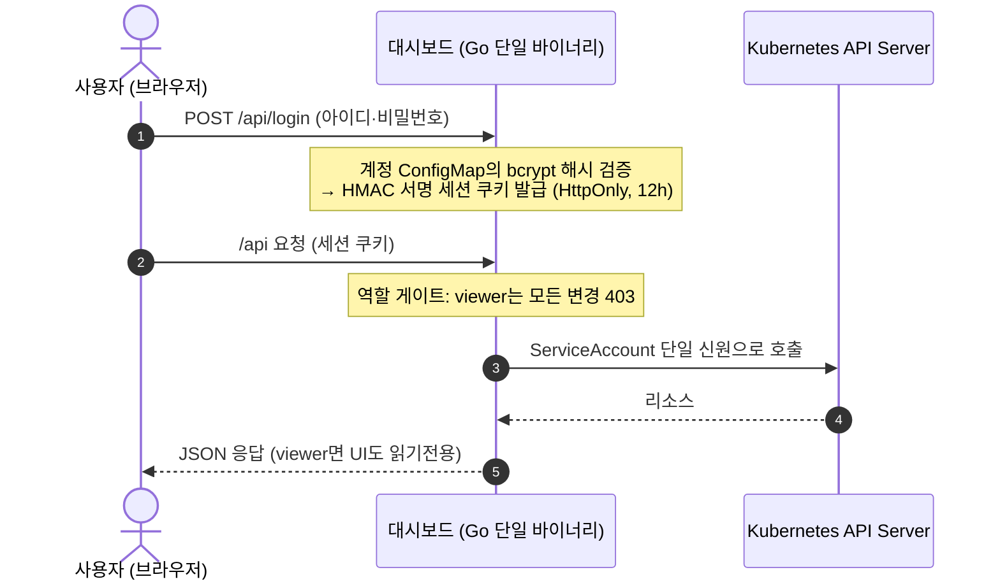

# Istio Routing Dashboard


> Istio · Gateway API 라우팅/보안/텔레메트리 설정을 **계정·역할 기반으로 안전하게** 보고·만들고·고치는 단일 바이너리 웹 콘솔.


---

## 요약 (TL;DR)

- **ArgoCD 방식 인증** — 계정은 ConfigMap 하나로 관리(사용자 = `역할:bcrypt해시`), 로그인하면 HMAC 서명 세션 쿠키. 클러스터 작업은 파드 ServiceAccount **단일 신원**으로 수행하고, 누가 무엇을 할 수 있는지는 앱 역할(`admin`/`editor`/`viewer`)이 결정한다. 설치 시 admin 계정이 없으면 **초기 계정 `admin`/`admin`을 자동 생성한다** (첫 로그인 후 비밀번호 변경 권장).
- **쓰기 안전 우선** — 모든 쓰기는 `dry-run` 선검증 → `kubectl diff` 스타일 미리보기 → 적용. `resourceVersion` 낙관적 락으로 409 충돌을 감지해 *내 수정본 vs 서버 최신본*을 대조하고, 고위험 kind는 이름 타이핑 확인을 요구한다. 대시보드를 거친 모든 변경은 홈의 **변경 히스토리**에 계정명과 함께 기록된다.
- **무상태 HA · 에어갭** — Go `embed.FS`에 React SPA를 내장한 단일 바이너리. 서버가 세션 저장소를 갖지 않아(서명 쿠키) N개 복제본으로 수평 확장되고, 외부 CDN 의존이 0이라 폐쇄망에서 즉시 구동된다.
- **제네릭 리소스 엔진** — 특정 CRD에 종속되지 않는 dynamic client 기반. Istio 12종 + Gateway API 7종을 하나의 CRUD 파이프라인으로 다룬다.
- **멀티클러스터** — ArgoCD처럼 kubeconfig를 붙여넣어 원격 클러스터를 등록하고(설정 페이지, admin), 헤더 드롭다운으로 전환한다. 자격증명은 로컬 클러스터 Secret에만 저장되고, 대상 클러스터에는 아무것도 설치하지 않는다.

---

## 왜 만들었나

Istio 라우팅은 `VirtualService` 하나의 오타가 서비스 전체 장애로 직결된다. 그런데 이걸 다루는 방법은 보통 두 갈래다 — 날 YAML을 `kubectl apply` 하거나(휴먼 에러에 무방비), Kiali처럼 관측에 특화된 도구를 쓰거나(설정 편집은 약함). 이 프로젝트는 그 사이의 빈칸, 즉 **"안전하게 설정을 편집하는 콘솔"** 을 채운다.

핵심 제약은 하나였다 — **"대시보드를 띄우는 것만으로 동작해야 한다."** 클러스터에 별도 CRD/Operator를 설치하지 않고, 붙는 순간 기존 리소스를 읽어 렌더링한다. 이를 위해 K8s를 유일한 진실의 원천으로 두고, 대시보드 자신은 상태를 갖지 않도록 설계했다.

---

## 아키텍처 & 보안 모델



- **로컬 계정 = ConfigMap** — `istio-dashboard-accounts` ConfigMap의 키 하나가 계정 하나(`사용자명: "역할:bcrypt해시"`). 파드가 아니라 클러스터(etcd)에 저장되므로 **파드 재시작·재배포에도 계정은 유지**되고, 헬름이 이 CM을 관리하지 않아 upgrade에도 살아남는다. 변경은 마운트 동기화로 **재시작 없이 1분 내 반영**된다.
- **계정 관리 UI** — admin은 설정 페이지에서 계정 추가·역할/비밀번호 변경·삭제를 할 수 있다(`GET/PUT/DELETE /api/accounts`, 서버가 CM을 patch). 잠금 방지를 위해 본인 삭제·본인 역할 변경은 차단. 물론 `kubectl edit`으로도 가능하다.
- **초기 admin 자동 생성** — 부팅 시 admin 계정이 없으면 `admin`/`admin`으로 만든다. 첫 로그인 후 설정 페이지에서 반드시 비밀번호를 변경하자.
- **역할 3종** — `viewer`(조회만) · `editor`(변경 가능) · `admin`. 서버가 모든 변경 요청을 역할로 게이트하고(403), UI도 같은 정보로 버튼을 비활성화한다.
- **본인 비밀번호 변경** — 헤더의 사용자 칩 → 설정 페이지에서 현재 비밀번호 확인 후 변경(viewer 포함). 서버가 CM의 본인 키만 patch한다.
- **멀티클러스터** — 원격 클러스터 kubeconfig는 `istio-dashboard-clusters` Secret에 저장(키 = 클러스터명). 등록/삭제는 admin 전용 UI(`PUT/DELETE /api/clusters/{name}`, 등록 시 연결 테스트), 모든 API는 `?cluster=` 파라미터로 대상을 고른다(기본 `local`). CRD 카탈로그·스키마 캐시는 클러스터별로 분리되어 설치된 CRD가 달라도 안전하다.
- **세션은 서명 쿠키** — 서버 저장소가 없어 무상태 HA 그대로. `SESSION_SECRET` 미설정 시 부팅마다 랜덤 키(재시작 = 재로그인).
- **하드닝** — CSP(`default-src 'self'`) 등 보안 헤더, HttpOnly 쿠키, distroless non-root, readOnlyRootFilesystem.
- **에어갭** — 프론트 번들을 바이너리에 인라인. 런타임 외부 의존 0.

---

## 핵심 기능

### 제네릭 리소스 엔진
dynamic client(unstructured) 기반의 단일 CRUD 경로(`/api/resources/{type}`)로 아래를 모두 다룬다. 클러스터에 설치된 CRD만 자동 노출된다(`/api/capabilities`, `/api/resourceTypes`).

| 카테고리 | Kind |
|---|---|
| **Traffic** (Istio) | VirtualService · DestinationRule · Gateway · ServiceEntry · Sidecar · WorkloadEntry · WorkloadGroup · EnvoyFilter |
| **Security** (Istio) | AuthorizationPolicy · PeerAuthentication · RequestAuthentication |
| **Telemetry** (Istio) | Telemetry |
| **Gateway API** | GatewayClass · Gateway · HTTPRoute · GRPCRoute · TCPRoute · TLSRoute · ReferenceGrant |

### 다중 쓰기 안전장치
1. **dry-run 선검증** — 저장 전 `DryRun=All`로 Admission Webhook·스키마 오류를 먼저 잡는다.
2. **diff 미리보기** — 적용 전 현재본과 적용본의 라인 단위 변경을 `kubectl diff` 스타일로 보여준다.
3. **409 충돌 제어** — `resourceVersion` 불일치 시 무조건 덮어쓰지 않고, *내 수정본 vs 서버 최신본* diff를 띄워 사용자가 덮어쓸지 결정하게 한다.
4. **고위험 확인** — 파급이 큰 kind는 리소스 이름을 직접 입력해야 삭제/수정이 진행된다.

### 역할 인식 UI + 변경 히스토리
- 로그인 계정의 역할을 미리 확인해, viewer면 폼과 적용/삭제 버튼을 **읽기전용**으로 전환한다. 서버도 같은 규칙으로 모든 변경을 403 처리하므로 UI 우회가 불가능하다.
- 홈의 **변경 히스토리** 패널에 대시보드를 거친 생성/수정/삭제가 계정명·시각과 함께 남는다(서버 인메모리 최근 200건 — 재시작 시 초기화, 영구 기록은 구조화 감사 로그). 홈 카드에는 istiod 컨트롤플레인 실제 버전(예: `1.30.2`)도 표시된다.

### 스키마 자동 폼 + YAML 이중 편집
- `react-jsonschema-form`이 CRD OpenAPI 스키마를 읽어 입력 폼을 자동 생성 — YAML을 몰라도 안전하게 편집.
- **필수/권장 표시** — 모든 필드에 `*`(필수) · `(권장)` · `(선택)` 배지. CRD 스키마의 `required`에 더해, Istio 스키마가 최상위에 required를 안 적는 문제를 curated 목록으로 보완한다(VS `hosts`, DR `host`, Gateway `selector`/`servers`, SE `hosts`/`ports`). `exportTo`처럼 API상 선택이지만 실무상 채워야 하는 필드는 `(권장)`으로 구분한다. 필수 섹션의 아코디언은 처음부터 펼쳐진다.
- **참조 해결 폼** — `host`/`backendRefs`는 Service, `subset`은 DestinationRule subset, `gateways`/`parentRefs`는 Gateway로 실제 클러스터 리소스를 자동완성 제안하고, 존재 여부 배지(✓/⚠)와 바로가기 링크를 붙인다. Gateway는 공용 네임스페이스에 사는 게 보통이라 클러스터 전체에서 조회하고, 다른 NS 것을 고르면 Istio 규격대로 `ns/이름`을 넣어준다(`mesh` 옵션 포함). 외부 호스트·크로스 NS 참조를 막지 않도록 free-text는 유지한다.
- 폼 ↔ YAML 상호 동기화. 폼이 표현 못 하는 고급 필드가 있으면 폼 탭을 잠그고 "YAML 전용"으로 안내 → 필드 유실 방지.

### UI
라이트 기본의 고밀도 콘솔(다크 토글 지원). 액센트 색은 CSS 변수 한 곳(`--accent`)에서 관리되어 한 줄 수정으로 리스킨된다. YAML 에디터에는 들여쓰기 가이드라인이 표시되어 인덴트 실수를 눈으로 잡을 수 있다.


---

## 빠른 시작 (Kubernetes 배포)

이 프로젝트는 클러스터 안에서 돌리는 게 기본이다. 빌드 도구 없이 Docker와 Helm만 있으면 된다(이미지 빌드가 멀티스테이지라 Go/Node 로컬 설치 불필요).

### 1) 이미지 빌드 & 푸시
```bash
docker build -t <registry>/istio-dashboard:<tag> .
docker push <registry>/istio-dashboard:<tag>
```

### 2) Helm 설치
```bash
helm install istio-dashboard ./deploy/helm -n istio-system \
  --set image.repository=<registry>/istio-dashboard --set image.tag=<tag>
```
주요 values: `image.*`, `imagePullSecrets`(사설 레지스트리), `replicaCount`(무상태라 늘리면 그대로 HA), `accountsConfigMap`(계정 ConfigMap 이름). 파드는 distroless non-root(uid 65532) + readOnlyRootFilesystem으로 뜬다.

### 3) 노출 — 클러스터의 Gateway에 HTTPRoute 부착
```bash
# parentRefs·hostname을 환경에 맞게 수정 후
kubectl apply -f deploy/examples/httproute.yaml
```

### 4) 로그인
첫 부팅 때 초기 계정 **`admin` / `admin`** 이 자동 생성된다. 로그인 후 설정 페이지(헤더의 사용자 칩)에서 반드시 비밀번호를 변경하자.


### 5) 계정 추가
admin으로 로그인하면 **설정 페이지의 계정 관리**에서 계정 추가·역할/비밀번호 변경·삭제를 UI로 할 수 있다 (본인 삭제·본인 역할 변경은 잠금 방지를 위해 차단). 저장소는 여전히 ConfigMap이므로 kubectl로도 가능하다:
```bash
go run ./hack/bcrypt-hash.go '비밀번호'                      # bcrypt 해시 생성
# (Go가 없으면) htpasswd -bnBC 10 "" '비밀번호' | tr -d ':\n'
kubectl -n istio-system edit configmap istio-dashboard-accounts
# data에 추가:  사용자명: "역할:해시"   (역할: admin | editor | viewer)
```
재시작 불필요 — 마운트 동기화로 1분 내 반영된다. 예시는 `deploy/examples/accounts-configmap.yaml` 참고.

---

## 설정

| 플래그 / 환경변수 | 기본값 | 설명 |
|---|---|---|
| `--addr` | `:8080` | 리슨 주소 |
| `--dev` | `false` | 로그인 생략 + 로컬 kubeconfig 사용 (**인클러스터 감지 시 부팅 거부**) |
| `--kubeconfig` | (기본 로딩 규칙) | dev 전용 kubeconfig 경로 |
| `ACCOUNTS_DIR` | `/etc/istio-dashboard/accounts` | 계정 ConfigMap 마운트 경로 |
| `ACCOUNTS_CONFIGMAP` / `POD_NAMESPACE` | (헬름이 주입) | 비밀번호 변경·초기 admin 생성이 patch할 CM 위치 |
| `SESSION_SECRET` | (없음) | 세션 쿠키 서명 키. 비우면 부팅마다 랜덤(재시작 = 재로그인) |

프로브: `/healthz` (live) · `/readyz` (ready) · `/metrics` (Prometheus). 로그는 `slog` JSON 구조화(요청 로그 + 쓰기 감사 로그).

---

## 기술적 의사결정

### 왜 kind 전용 구조 대신 제네릭 엔진인가
초기 설계는 `HTTPRoute`/`VirtualService` 두 kind에 전용 provider를 두는 방식이었다. 하지만 Istio·Gateway API는 kind가 20종에 달하고 CRD 버전이 계속 바뀐다. 전용 모델을 kind마다 만들면 관리 비용이 선형으로 늘고 CRD 버전 변화에 취약하다. → **dynamic client + CRD OpenAPI 스키마 자동 폼**으로 전환해, kind 추가가 레지스트리 한 줄로 끝나고 스키마 변화에 자동 적응하도록 했다. 대신 kind별 curated 폼이 필요한 소수(예: VirtualService)는 선택적으로 얹을 수 있게 남겨뒀다.

### 왜 토큰 패스스루에서 ArgoCD 방식으로 바꿨나
초기 구현은 사용자의 K8s Bearer 토큰을 그대로 패스스루해 클러스터 RBAC로 인가했다 — 권한 모델은 정확했지만, 사용자마다 토큰을 발급·전달·갱신해야 하는 운영 부담이 컸고 로그인 UX도 나빴다. → ArgoCD처럼 **앱 자체 계정(ConfigMap) + 역할**로 전환하고 클러스터 작업은 SA 단일 신원으로 통일했다. K8s 감사 로그에 사용자 대신 SA가 찍히는 단점은 대시보드 자체의 변경 히스토리(계정명 기록)로 상쇄한다. 사용자별 K8s RBAC 일치가 꼭 필요해지면 Impersonation 방식으로 확장할 수 있다.

### 왜 실시간 SSE 스트림을 넣지 않았나
설계 단계에선 사용자별 watch → SSE 실시간 동기화를 계획했다. 그러나 **무상태 HA를 지키려면** 연결마다 watch를 열어야 하고, 이는 복제본 수 × 동접 수만큼 API 서버 watch 연결을 만든다. 사내 운영 도구(동접 수십, 변경 저빈도)라는 실제 사용 맥락에서 이 비용은 정당화되지 않았다. → 서버 무상태성을 그대로 지키는 쪽을 택하고, **서버 인메모리 변경 히스토리**(30초 주기 갱신)와 수동 새로고침으로 수렴시켰다. *"있으면 좋은 실시간"보다 "깨지지 않는 무상태 HA"를 우선한 의도적 타협.*

### 왜 `--dev` 부팅 가드레일인가
`--dev`는 로그인을 건너뛰고 로컬 kubeconfig를 쓴다 — 로컬에선 편하지만 운영 클러스터에서 켜지면 인증 우회가 된다. 그래서 모든 파드에 주입되는 `KUBERNETES_SERVICE_HOST`가 감지되면 `--dev` 플래그가 있을 때 **즉시 종료**한다(CrashLoopBackOff 유도). 실수로 dev 모드가 클러스터에 배포되는 사고를 구조적으로 차단한다.

---

## 프로젝트 구조

```
istio_dashboard/
├─ cmd/server/main.go          # 엔트리포인트: ServeMux, 프로브/metrics, graceful shutdown
├─ internal/
│  ├─ api/                     # JSON 핸들러 (resources CRUD, login/계정, capabilities, 변경 히스토리)
│  ├─ auth/                    # 로컬 계정(bcrypt) + HMAC 세션 (ArgoCD 방식)
│  ├─ k8s/                     # dynamic client 팩토리, kind 레지스트리, discovery, 참조 조회
│  ├─ assets/                  # 빌드된 React(dist) embed + SPA fallback
│  └─ observability/           # slog 로깅, Prometheus metrics
├─ web/                        # React 18 + TS + Vite + Tailwind + rjsf + CodeMirror
├─ hack/bcrypt-hash.go         # 계정 비밀번호 해시 생성 헬퍼
├─ deploy/
│  ├─ helm/                    # Chart: deployment / service / rbac / values
│  └─ examples/                # accounts-configmap.yaml(계정) · httproute.yaml(노출 예시)
├─ Dockerfile  go.mod
```

## 기술 스택
- **백엔드** — Go 1.26, `net/http` (1.22 ServeMux), `client-go` dynamic client, `istio.io/client-go`, `sigs.k8s.io/gateway-api`
- **프론트엔드** — React 18 · TypeScript · Vite · Tailwind · TanStack Query · React Router · react-jsonschema-form · CodeMirror
- **배포** — 멀티스테이지 Docker(distroless, non-root) · Helm

## 개발

로컬 개발·테스트용 (배포에는 필요 없다 — 배포는 위 Docker+Helm 경로). 요구사항: Go 1.26+, Node.js 20+, kubectl 컨텍스트(kind/docker-desktop이면 충분).

```bash
go run ./cmd/server --dev          # 백엔드 :8080, 로컬 kubeconfig 사용 (인클러스터에선 부팅 거부)
cd web && npm run dev              # 프론트 HMR: Vite :5173 → /api 프록시 → :8080

go test ./...                      # 단위 테스트 (인증 경계·레지스트리 캐시·쓰기 가드·감사 로그, fake client 기반)
go vet ./...

# 컨테이너 없이 단일 바이너리로 구동할 때
cd web && npm ci && npm run build  # 프론트 빌드 → internal/assets/dist
CGO_ENABLED=0 go build -ldflags="-s -w" -o bin/server ./cmd/server
```

## 권한 모델

ArgoCD와 같은 구조다 — 클러스터 권한과 사용자 권한을 분리한다:

| 층 | 담당 | 내용 |
|---|---|---|
| 클러스터 (K8s RBAC) | 파드 ServiceAccount | 관리 대상 CRD(`*.networking.istio.io`, `security/telemetry.istio.io`, `*.gateway.networking.k8s.io`) CRUD + namespaces/services 읽기 + 계정 CM patch. 헬름이 자동 구성. |
| 사용자 (앱 역할) | 계정 ConfigMap | `admin` = 변경 + 계정 관리, `editor` = 변경 가능, `viewer` = 조회만. 서버가 모든 변경 요청을 역할로 게이트(403). |

계정 관리는 admin이 설정 페이지의 **계정 관리 UI**에서 하거나(추가·역할/비밀번호 변경·삭제), `istio-dashboard-accounts` ConfigMap을 직접 편집해도 된다(키 추가 = 계정 추가, 값의 역할 문자열 수정 = 역할 변경, 키 삭제 = 계정 삭제). 본인 비밀번호는 각자 설정 페이지에서 변경한다.

## 라이선스

[MIT](LICENSE)
